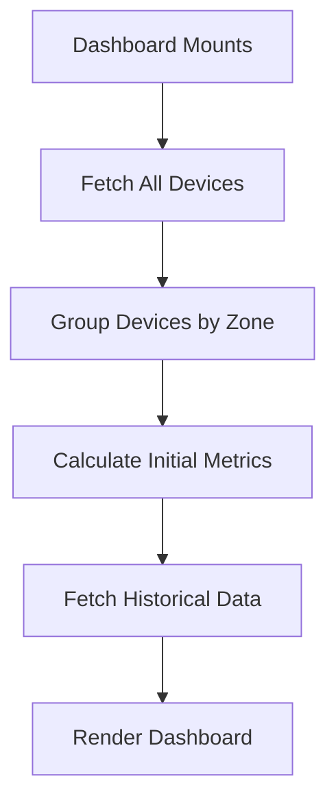
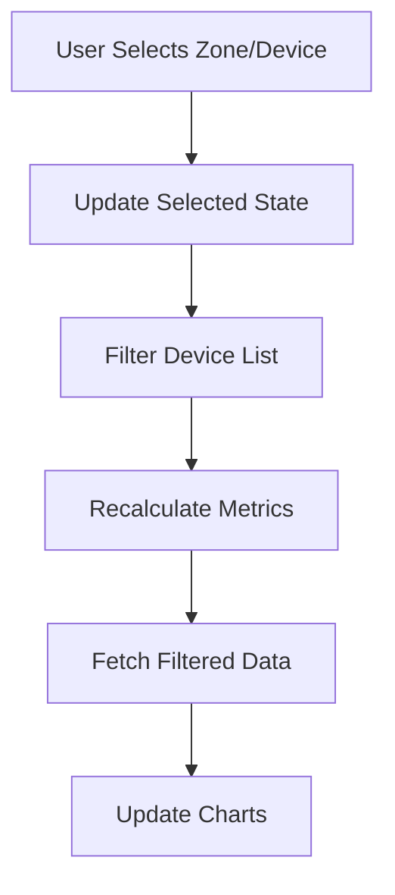
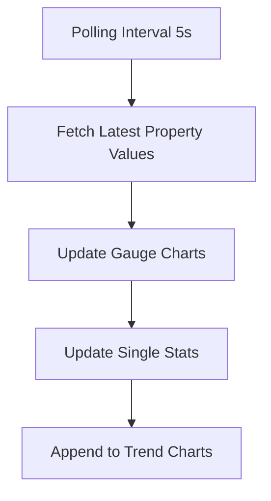

# Dynamic Dashboard Architecture Plan

## Overview
Create a comprehensive, dynamic dashboard for the DALI IoT Pro system that displays device metrics through various chart types, single stat KPI cards, and data tables. Users can filter by zones/devices to view specific data.

## Technology Stack
- **React** with TypeScript
- **Material-UI (MUI)** for UI components
- **ECharts** (via echarts-for-react) for data visualization
- **React Router** for navigation
- **Axios** for API calls
- **TailwindCSS** for additional styling

## Component Architecture

### 1. Chart Components

#### [`BarChart.tsx`](apps/dashboard/src/components/charts/BarChart.tsx)
```typescript
interface BarChartProps {
  data: { name: string; value: number }[];
  title: string;
  color?: string;
  horizontal?: boolean;
}
```
- Displays comparative data across categories
- Use cases: Compare energy consumption across devices, light levels by zone

#### [`PieChart.tsx`](apps/dashboard/src/components/charts/PieChart.tsx)
```typescript
interface PieChartProps {
  data: { name: string; value: number }[];
  title: string;
  colors?: string[];
}
```
- Shows distribution and proportions
- Use cases: Device distribution by zone, error types breakdown

#### [`AreaChart.tsx`](apps/dashboard/src/components/charts/AreaChart.tsx)
```typescript
interface AreaChartProps {
  data: { time: string; value: number }[];
  title: string;
  color?: string;
  gradient?: boolean;
}
```
- Displays trends over time with filled area
- Use cases: Power consumption trends, temperature variations

#### Existing Components
- [`RealTimeGauge.tsx`](apps/dashboard/src/components/charts/RealTimeGauge.tsx) - Already exists
- [`HistoryChart.tsx`](apps/dashboard/src/components/charts/HistoryChart.tsx) - Already exists (line chart)

### 2. UI Components

#### [`StatCard.tsx`](apps/dashboard/src/components/StatCard.tsx)
```typescript
interface StatCardProps {
  title: string;
  value: string | number;
  unit?: string;
  icon?: React.ReactNode;
  trend?: {
    value: number;
    direction: 'up' | 'down';
  };
  color?: string;
}
```
- Displays single KPI metrics
- Shows trend indicators (optional)
- Material-UI Card with custom styling

#### [`DeviceSelector.tsx`](apps/dashboard/src/components/DeviceSelector.tsx)
```typescript
interface DeviceSelectorProps {
  devices: Device[];
  selectedDevices: string[];
  selectedZones: string[];
  onDeviceChange: (deviceIds: string[]) => void;
  onZoneChange: (zones: string[]) => void;
}
```
- Multi-select dropdown for zones
- Multi-select dropdown for devices
- Filter devices by selected zones
- Material-UI Autocomplete components

#### [`DataTable.tsx`](apps/dashboard/src/components/DataTable.tsx)
```typescript
interface DataTableProps {
  columns: { field: string; headerName: string; width?: number }[];
  rows: any[];
  loading?: boolean;
  pageSize?: number;
}
```
- Displays tabular data with sorting
- Pagination support
- Material-UI Table or DataGrid

#### [`TimeRangeSelector.tsx`](apps/dashboard/src/components/TimeRangeSelector.tsx)
```typescript
interface TimeRangeSelectorProps {
  value: string;
  onChange: (range: string) => void;
  options?: { label: string; value: string }[];
}
```
- Predefined time ranges: 1h, 6h, 24h, 7d, 30d
- Material-UI Select or ToggleButtonGroup

### 3. Main Dashboard Page

#### [`Dashboard.tsx`](apps/dashboard/src/pages/Dashboard.tsx)

**Layout Structure:**
```
┌─────────────────────────────────────────────────────┐
│  Device/Zone Selector    Time Range Selector        │
├──────────┬──────────┬──────────┬──────────┬─────────┤
│ Total    │ Avg Light│ Energy   │ Active   │         │
│ Devices  │ Level    │ Consumed │ Errors   │         │
├──────────┴──────────┴──────────┴──────────┴─────────┤
│                                                      │
│  Line Chart: Light Level Trends (24h)               │
│                                                      │
├─────────────────────────┬────────────────────────────┤
│                         │                            │
│  Bar Chart:             │  Pie Chart:                │
│  Energy by Device       │  Devices by Zone           │
│                         │                            │
├─────────────────────────┴────────────────────────────┤
│                                                      │
│  Gauge Charts: Real-time Metrics (Power, Temp, etc) │
│                                                      │
├──────────────────────────────────────────────────────┤
│                                                      │
│  Data Table: Device Properties                      │
│                                                      │
└──────────────────────────────────────────────────────┘
```

**State Management:**
```typescript
interface DashboardState {
  devices: Device[];
  selectedDevices: string[];
  selectedZones: string[];
  timeRange: string;
  loading: boolean;
  error: string | null;
  metrics: {
    totalDevices: number;
    avgLightLevel: number;
    totalEnergy: number;
    activeErrors: number;
  };
  chartData: {
    lightLevelTrend: { time: string; value: number }[];
    energyByDevice: { name: string; value: number }[];
    devicesByZone: { name: string; value: number }[];
    realTimeMetrics: {
      power: number;
      temperature: number;
      voltage: number;
    };
  };
}
```

## Data Flow

### 1. Initial Load


### 2. Filter Change


### 3. Real-time Updates


## API Integration

### Endpoints Used

1. **Get All Devices**
   - `GET /api/bmsapi/dali-devices`
   - Returns list of all devices with properties

2. **Get Device Details**
   - `GET /api/bmsapi/dali-devices/{guid}`
   - Returns specific device information

3. **Get Property Value (Active)**
   - `GET /api/bmsapi/dali-devices/{guid}/property/{property}/active`
   - Returns current value of a property

4. **Get Property Value (Last)**
   - `GET /api/bmsapi/dali-devices/{guid}/property/{property}/last`
   - Returns most recent value

5. **Get Historical Data**
   - `GET /api/devices/{guid}/history?property={property}&range={range}`
   - Returns time-series data for charts

### Data Fetching Strategy

```typescript
// Custom hooks for data management
useDevices() // Fetch and cache device list
useDeviceMetrics(deviceIds, timeRange) // Fetch aggregated metrics
useRealTimeData(deviceIds, properties) // Poll for real-time updates
useHistoricalData(deviceId, property, range) // Fetch time-series data
```

## Key Metrics (KPI Cards)

1. **Total Devices**
   - Count of all devices (filtered by selection)
   - Icon: DevicesIcon

2. **Average Light Level**
   - Average of `lightLevel` property across selected devices
   - Unit: % or lux
   - Icon: LightbulbIcon

3. **Total Energy Consumption**
   - Sum of `driverEnergyConsumption` across devices
   - Unit: Wh or kWh
   - Icon: BoltIcon

4. **Active Errors Count**
   - Count of devices with `errorOverall` flag set
   - Color: Red if > 0
   - Icon: ErrorIcon

## Chart Configurations

### 1. Line Chart - Light Level Trends
- **Data Source**: Historical `lightLevel` property
- **X-Axis**: Time (based on selected range)
- **Y-Axis**: Light level (%)
- **Features**: Smooth curves, tooltips, zoom

### 2. Bar Chart - Energy by Device
- **Data Source**: `driverEnergyConsumption` per device
- **X-Axis**: Device names
- **Y-Axis**: Energy (Wh)
- **Features**: Horizontal bars, color gradient

### 3. Pie Chart - Devices by Zone
- **Data Source**: Device count grouped by zone
- **Features**: Labels with percentages, legend

### 4. Gauge Charts - Real-time Metrics
- **Metrics**: 
  - Driver Input Power (W)
  - Driver Temperature (°C)
  - Input Voltage (Vrms)
- **Features**: Animated updates, color thresholds

### 5. Area Chart - Power Consumption Trend
- **Data Source**: Historical `driverInputPower`
- **Features**: Gradient fill, smooth curves

## Data Table Configuration

**Columns:**
- Device Name
- Zone
- Light Level (%)
- Input Power (W)
- Energy Consumption (Wh)
- Temperature (°C)
- Status (OK/Error)

**Features:**
- Sortable columns
- Pagination (10 rows per page)
- Row click to view device details

## Responsive Design

### Breakpoints (Material-UI)
- **xs** (mobile): Stack all components vertically
- **sm** (tablet): 2-column grid for stat cards
- **md** (desktop): 4-column grid for stats, 2-column for charts
- **lg** (large): Full dashboard layout as shown

### Grid Layout (Material-UI Grid)
```typescript
<Grid container spacing={3}>
  {/* Filters */}
  <Grid item xs={12}>...</Grid>
  
  {/* Stat Cards */}
  <Grid item xs={12} sm={6} md={3}>...</Grid>
  
  {/* Charts */}
  <Grid item xs={12} md={12}>...</Grid>
  <Grid item xs={12} md={6}>...</Grid>
  
  {/* Table */}
  <Grid item xs={12}>...</Grid>
</Grid>
```

## Error Handling

1. **API Errors**
   - Display error message in Snackbar
   - Show fallback UI for failed components
   - Retry mechanism for failed requests

2. **No Data**
   - Empty state messages
   - Suggestions to select devices/zones

3. **Loading States**
   - Skeleton loaders for charts
   - Progress indicators for data fetching

## Performance Optimizations

1. **Memoization**
   - Use `React.memo` for chart components
   - `useMemo` for expensive calculations

2. **Debouncing**
   - Debounce filter changes (300ms)
   - Prevent excessive API calls

3. **Lazy Loading**
   - Code-split chart components
   - Load data on-demand

4. **Caching**
   - Cache device list in memory
   - Use React Query for server state management (optional)

## Accessibility

- ARIA labels for all interactive elements
- Keyboard navigation support
- Screen reader friendly chart descriptions
- High contrast mode support

## Testing Strategy

1. **Unit Tests**
   - Test individual chart components
   - Test data transformation functions
   - Test custom hooks

2. **Integration Tests**
   - Test dashboard with mock API data
   - Test filter interactions
   - Test real-time updates

3. **E2E Tests**
   - Test complete user workflows
   - Test with Playwright/Cypress

## Future Enhancements

1. **WebSocket Integration**
   - Replace polling with WebSocket for real-time updates
   - More efficient data streaming

2. **Export Functionality**
   - Export charts as images
   - Export table data as CSV/Excel

3. **Custom Dashboard Builder**
   - Drag-and-drop widget arrangement
   - Save custom layouts per user

4. **Alerts & Notifications**
   - Set thresholds for metrics
   - Email/push notifications for errors

5. **Comparison Mode**
   - Compare metrics across time periods
   - Compare multiple devices side-by-side

## Implementation Order

1. Create all chart components (Bar, Pie, Area)
2. Create StatCard component
3. Create DeviceSelector and TimeRangeSelector
4. Create DataTable component
5. Build Dashboard page layout
6. Implement data fetching logic
7. Add real-time polling
8. Integrate all components
9. Add error handling and loading states
10. Add route to App.tsx
11. Test with real API
12. Refine styling and responsiveness
