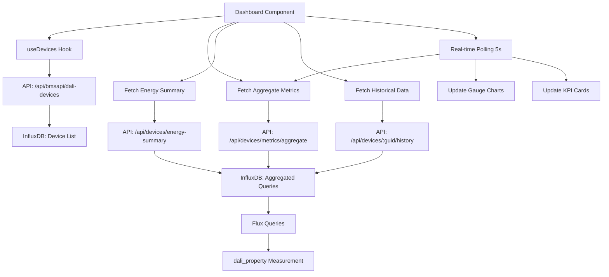

# Dynamic Dashboard - Implementation Summary

## Overview

This plan outlines the creation of a comprehensive, dynamic dashboard for the DALI IoT Pro system that displays device metrics through various chart types (line, bar, pie, area, gauge), single stat KPI cards, and data tables. Users can filter by zones/devices to view specific data.

## Available Properties from InfluxDB

The dashboard will use the following properties collected in InfluxDB:

**Power & Energy:**
- `driverInputPower` - Active input power (W)
- `driverEnergyConsumption` - Active input energy (Wh)
- `driverInputVoltage` - Driver input voltage (Vrms)

**Temperature:**
- `driverTemperature` - Driver temperature (°C)

**Operation Time:**
- `driverOperationTime` - Driver operation time (s)
- `lampOperationTime` - Lamp operation time (s)

**Light Control:**
- `lightLevel` - DALI control gear light level (%)

**Error Monitoring:**
- `errorOverall` - Overall error flag
- `errorBits` - Error bits
- `errorBitsCoupler` - Error bits coupler

See [`dashboard-available-properties.md`](dashboard-available-properties.md) for detailed property reference.

---

## Architecture Documents

1. **[`dashboard-architecture.md`](dashboard-architecture.md)** - High-level architecture, component structure, data flow, and design patterns
2. **[`dashboard-component-specs.md`](dashboard-component-specs.md)** - Detailed specifications for all components with code examples
3. **[`dashboard-implementation-example.md`](dashboard-implementation-example.md)** - Complete implementation example of the Dashboard page
4. **[`dashboard-influxdb-queries.md`](dashboard-influxdb-queries.md)** - InfluxDB data schema and query specifications

---

## Key Features

### 1. KPI Cards (Single Stats)
- **Total Devices**: Count of devices (filtered by selection)
- **Average Light Level**: Average across selected devices
- **Total Energy Consumption**: Sum of energy consumed
- **Active Errors Count**: Number of devices with errors

### 2. Chart Types
- **Line Chart**: Light level trends over time
- **Bar Chart**: Energy consumption comparison by device
- **Pie Chart**: Device distribution by zone
- **Area Chart**: Power consumption trend with gradient
- **Gauge Charts**: Real-time metrics (power, temperature, voltage)

### 3. Data Table
- Displays device properties in tabular format
- Sortable columns, pagination
- Click to navigate to device details

### 4. Filters
- **Zone Selector**: Multi-select dropdown for zones
- **Device Selector**: Multi-select dropdown for devices
- **Time Range Selector**: 1H, 6H, 24H, 7D, 30D

### 5. Real-time Updates
- Polling every 5 seconds for gauge charts
- Automatic metric recalculation
- Live data appending to trend charts

---

## Technology Stack

- **Frontend**: React + TypeScript
- **UI Framework**: Material-UI (MUI)
- **Charts**: ECharts (via echarts-for-react)
- **Routing**: React Router
- **HTTP Client**: Fetch API (via apiClient)
- **Styling**: TailwindCSS + MUI theme
- **Backend**: Fastify (Node.js)
- **Database**: InfluxDB 2.x (time-series data)

---

## Component Structure

```
apps/dashboard/src/
├── components/
│   ├── charts/
│   │   ├── BarChart.tsx          (NEW)
│   │   ├── PieChart.tsx          (NEW)
│   │   ├── AreaChart.tsx         (NEW)
│   │   ├── RealTimeGauge.tsx     (EXISTS)
│   │   └── HistoryChart.tsx      (EXISTS)
│   ├── StatCard.tsx              (NEW)
│   ├── DeviceSelector.tsx        (NEW)
│   ├── TimeRangeSelector.tsx     (NEW)
│   └── DataTable.tsx             (NEW)
├── hooks/
│   ├── useDevices.ts             (NEW)
│   ├── useDeviceProperty.ts      (NEW)
│   └── useHistoricalData.ts      (NEW)
├── utils/
│   └── dataTransform.ts          (NEW)
├── types/
│   └── dashboard.ts              (NEW)
└── pages/
    └── Dashboard.tsx             (NEW - MAIN PAGE)
```

---

## API Architecture

### Data Sources
The Node.js API server connects to:
1. **Multiple DALI IoT Controllers** (via `/api/bmsapi/*` endpoints) - for device metadata
2. **InfluxDB** (via `/api/devices/*` endpoints) - for time-series property data

### Existing Endpoints

#### Device Metadata (from DALI Controllers)
- ✅ `GET /api/bmsapi/dali-devices` - Get all devices from all controllers
- ✅ `GET /api/bmsapi/dali-devices/:guid` - Get device details

#### Time-Series Data (from InfluxDB)
- ✅ `GET /api/devices/:guid/history` - Get historical data for a property
  - Query params: `property`, `range` (e.g., `1h`, `24h`, `7d`)
  - Returns: Array of time-series data points

### New Endpoints Required (All query InfluxDB)

#### 1. Aggregate Metrics
**Route**: `GET /api/devices/metrics/aggregate`

**Query Params**:
- `deviceIds` (optional): Comma-separated device GUIDs
- `zones` (optional): Comma-separated zones
- `properties` (optional): Properties to aggregate

**Response**:
```json
{
  "avgLightLevel": 78.5,
  "totalEnergy": 1250.8,
  "avgPower": 95.3,
  "deviceCount": 15,
  "errorCount": 2
}
```

#### 2. Energy Summary
**Route**: `GET /api/devices/energy-summary`

**Query Params**:
- `range` (default: 24h): Time range
- `limit` (default: 10): Number of devices

**Response**:
```json
[
  { "deviceGuid": "abc-123", "title": "EVG A63", "energy": 120.5, "unit": "Wh" },
  { "deviceGuid": "def-456", "title": "Ballast A00", "energy": 95.3, "unit": "Wh" }
]
```

#### 3. Latest Properties
**Route**: `GET /api/devices/:guid/properties/latest`

**Query Params**:
- `properties` (optional): Comma-separated property names

**Response**:
```json
{
  "deviceGuid": "abc-123",
  "title": "EVG A63",
  "timestamp": "2026-03-02T08:00:00Z",
  "properties": {
    "lightLevel": { "value": 78, "unit": "%" },
    "driverInputPower": { "value": 95.3, "unit": "W" }
  }
}
```

---

## InfluxDB Data Schema

### Measurement: `dali_property`

**Tags**:
- `controller`: Controller name
- `category`: Device category
- `device_guid`: Device GUID
- `property`: Property name
- `unit`: Unit of measurement
- `title`: Device title

**Fields**:
- `value_num`: Numeric value
- `value_str`: String value

**Timestamp**: Server receive time

---

## Implementation Steps

### Phase 1: Backend API (Services)
1. Create [`services/api/src/routes/metrics.ts`](services/api/src/routes/metrics.ts)
   - Implement aggregate metrics endpoint
   - Implement energy summary endpoint
   - Implement latest properties endpoint
2. Register new routes in [`services/api/src/server.ts`](services/api/src/server.ts)
3. Test endpoints with sample data

### Phase 2: Frontend Components
1. Create chart components:
   - [`BarChart.tsx`](apps/dashboard/src/components/charts/BarChart.tsx)
   - [`PieChart.tsx`](apps/dashboard/src/components/charts/PieChart.tsx)
   - [`AreaChart.tsx`](apps/dashboard/src/components/charts/AreaChart.tsx)
2. Create UI components:
   - [`StatCard.tsx`](apps/dashboard/src/components/StatCard.tsx)
   - [`DeviceSelector.tsx`](apps/dashboard/src/components/DeviceSelector.tsx)
   - [`TimeRangeSelector.tsx`](apps/dashboard/src/components/TimeRangeSelector.tsx)
   - [`DataTable.tsx`](apps/dashboard/src/components/DataTable.tsx)
3. Create custom hooks:
   - [`useDevices.ts`](apps/dashboard/src/hooks/useDevices.ts)
   - [`useDeviceProperty.ts`](apps/dashboard/src/hooks/useDeviceProperty.ts)
   - [`useHistoricalData.ts`](apps/dashboard/src/hooks/useHistoricalData.ts)
4. Create utilities:
   - [`dataTransform.ts`](apps/dashboard/src/utils/dataTransform.ts)
   - [`dashboard.ts`](apps/dashboard/src/types/dashboard.ts) (types)

### Phase 3: Dashboard Page
1. Create [`Dashboard.tsx`](apps/dashboard/src/pages/Dashboard.tsx)
2. Implement layout with Material-UI Grid
3. Integrate all components
4. Add data fetching logic
5. Implement real-time polling
6. Add error handling and loading states

### Phase 4: Integration & Testing
1. Add Dashboard route to [`App.tsx`](apps/dashboard/src/App.tsx)
2. Test with real API data
3. Verify responsive design
4. Test filter interactions
5. Optimize performance
6. Add accessibility features

---

## Dashboard Layout

```
┌─────────────────────────────────────────────────────────┐
│  Dashboard Header                                       │
├─────────────────────────────────────────────────────────┤
│  [Zone Selector] [Device Selector]  [Time Range]       │
├──────────┬──────────┬──────────┬──────────┬────────────┤
│ Total    │ Avg Light│ Energy   │ Active   │            │
│ Devices  │ Level    │ Consumed │ Errors   │            │
│   26     │  78.5%   │ 1250 Wh  │    2     │            │
├──────────┴──────────┴──────────┴──────────┴────────────┤
│                                                         │
│  📈 Line Chart: Light Level Trends (24h)               │
│                                                         │
├─────────────────────────┬───────────────────────────────┤
│                         │                               │
│  📊 Bar Chart:          │  🥧 Pie Chart:                │
│  Energy by Device       │  Devices by Zone              │
│                         │                               │
├─────────────────────────┴───────────────────────────────┤
│                                                         │
│  📈 Area Chart: Power Consumption Trend                │
│                                                         │
├──────────┬──────────┬──────────┬──────────┬────────────┤
│          │          │          │          │            │
│  ⏱ Gauge │  ⏱ Gauge │  ⏱ Gauge │          │            │
│  Power   │  Temp    │  Voltage │          │            │
│          │          │          │          │            │
├──────────┴──────────┴──────────┴──────────┴────────────┤
│                                                         │
│  📋 Data Table: Device Properties                      │
│  ┌────────────┬──────┬──────┬──────┬──────┬────────┐  │
│  │ Device     │ Zone │ Light│ Power│ Temp │ Status │  │
│  ├────────────┼──────┼──────┼──────┼──────┼────────┤  │
│  │ EVG A63    │ Z1   │ 78%  │ 95W  │ 45°C │ OK     │  │
│  │ Ballast A00│ Z1   │ 65%  │ 80W  │ 42°C │ OK     │  │
│  └────────────┴──────┴──────┴──────┴──────┴────────┘  │
│                                                         │
└─────────────────────────────────────────────────────────┘
```

---

## Data Flow Diagram



---

## Responsive Design

### Breakpoints
- **xs** (0-600px): Mobile - Stack all components vertically
- **sm** (600-960px): Tablet - 2-column grid for stats
- **md** (960-1280px): Desktop - 4-column stats, 2-column charts
- **lg** (1280px+): Large - Full dashboard layout

### Grid Configuration
```typescript
<Grid container spacing={3}>
  {/* Filters - Full width */}
  <Grid item xs={12}>...</Grid>
  
  {/* KPI Cards - Responsive */}
  <Grid item xs={12} sm={6} md={3}>...</Grid>
  
  {/* Charts - Responsive */}
  <Grid item xs={12} md={6}>...</Grid>
  
  {/* Table - Full width */}
  <Grid item xs={12}>...</Grid>
</Grid>
```

---

## Performance Optimizations

1. **Memoization**: Use `React.memo` and `useMemo` for expensive calculations
2. **Debouncing**: Debounce filter changes (300ms)
3. **Lazy Loading**: Code-split chart components
4. **Caching**: Cache device list in memory
5. **Batch Requests**: Combine multiple API calls with `Promise.all`
6. **Aggregate Windows**: Use InfluxDB aggregation for large time ranges

---

## Error Handling

1. **API Errors**: Display error messages in Snackbar
2. **No Data**: Show empty state with helpful messages
3. **Loading States**: Skeleton loaders for charts, progress indicators
4. **Retry Logic**: Automatic retry for failed requests
5. **Fallback UI**: Graceful degradation when components fail

---

## Accessibility

- ARIA labels for all interactive elements
- Keyboard navigation support
- Screen reader friendly chart descriptions
- High contrast mode support
- Semantic HTML structure

---

## Testing Strategy

### Unit Tests
- Test chart components with different props
- Test data transformation utilities
- Test custom hooks with mock data

### Integration Tests
- Test Dashboard with mock API data
- Test filter interactions
- Test real-time updates

### E2E Tests
- Test complete user workflows
- Test responsive layout
- Test error scenarios

---

## Next Steps

1. **Review this plan** and provide feedback
2. **Switch to Code mode** to begin implementation
3. **Start with backend APIs** (Phase 1)
4. **Build frontend components** (Phase 2)
5. **Integrate Dashboard page** (Phase 3)
6. **Test and refine** (Phase 4)

---

## Questions to Consider

1. Should we add export functionality (CSV, PNG)?
2. Do we need custom dashboard layouts (drag-and-drop)?
3. Should we implement WebSocket instead of polling?
4. Do we need alerts/notifications for threshold breaches?
5. Should we add comparison mode (compare time periods)?

---

## Estimated Complexity

- **Backend API**: Medium (3 new endpoints with Flux queries)
- **Frontend Components**: Medium-High (8 new components + 3 hooks)
- **Dashboard Page**: High (Complex state management, real-time updates)
- **Testing**: Medium (Unit + Integration tests)

**Total**: This is a substantial feature that will require careful implementation and testing.

---

## Files to Create/Modify

### Backend (Services)
- ✨ NEW: `services/api/src/routes/metrics.ts`
- 📝 MODIFY: `services/api/src/server.ts`

### Frontend (Dashboard)
- ✨ NEW: `apps/dashboard/src/components/charts/BarChart.tsx`
- ✨ NEW: `apps/dashboard/src/components/charts/PieChart.tsx`
- ✨ NEW: `apps/dashboard/src/components/charts/AreaChart.tsx`
- ✨ NEW: `apps/dashboard/src/components/StatCard.tsx`
- ✨ NEW: `apps/dashboard/src/components/DeviceSelector.tsx`
- ✨ NEW: `apps/dashboard/src/components/TimeRangeSelector.tsx`
- ✨ NEW: `apps/dashboard/src/components/DataTable.tsx`
- ✨ NEW: `apps/dashboard/src/hooks/useDevices.ts`
- ✨ NEW: `apps/dashboard/src/hooks/useDeviceProperty.ts`
- ✨ NEW: `apps/dashboard/src/hooks/useHistoricalData.ts`
- ✨ NEW: `apps/dashboard/src/utils/dataTransform.ts`
- ✨ NEW: `apps/dashboard/src/types/dashboard.ts`
- ✨ NEW: `apps/dashboard/src/pages/Dashboard.tsx`
- 📝 MODIFY: `apps/dashboard/src/App.tsx`

---

## Ready to Implement?

This plan provides a comprehensive blueprint for building the dynamic dashboard. All architectural decisions, component specifications, API endpoints, and data queries are documented and ready for implementation.

**Would you like to proceed with implementation, or do you have any questions or changes to the plan?**
